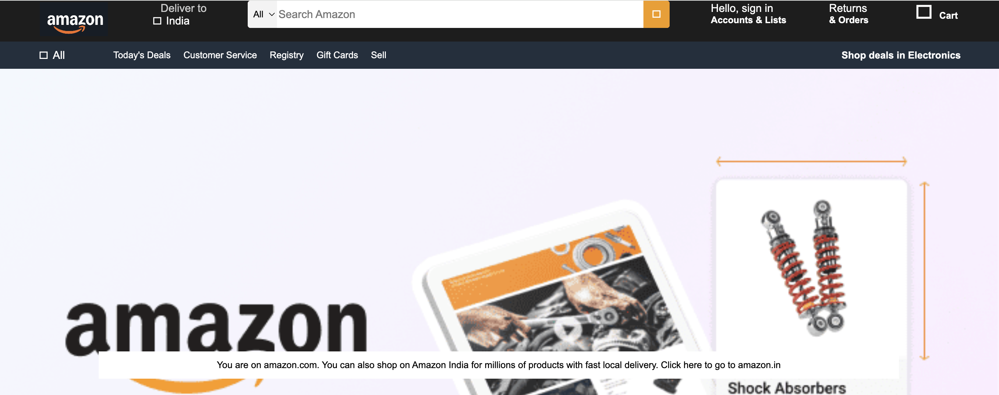
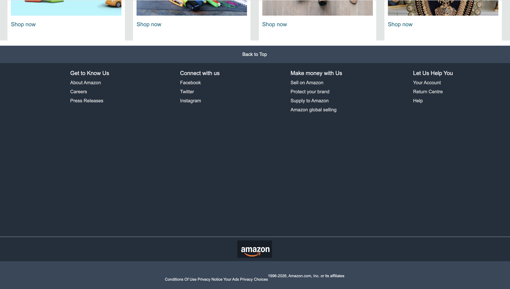

# Amazon Homepage UI Clone

A frontend clone of the Amazon homepage built using **HTML5** and **CSS3**. This project recreates the layout and design of Amazon's homepage to strengthen frontend development skills.

## Features

- Amazon-inspired navigation bar
- Amazon logo and header layout
- Search bar with category dropdown
- Navigation items with hover border effects
- Hero section
- 8 product category shopping boxes
- Responsive product cards
- Amazon-style footer with multiple sections
- Clean and organized UI

## Technologies Used

- HTML5
- CSS3

## Learning Outcomes

Through this project, I practiced:

- HTML page structuring
- CSS styling
- Flexbox
- Box model
- Hover effects
- Positioning and layout design
- Building real-world webpage layouts

## Project Preview

### Homepage

### Shopping Section

### Footer

## Future Improvements

- Make the website fully responsive
- Add JavaScript functionality
- Implement product search
- Create login and cart pages

## Author

**Arzoo Dahiya**

B.Tech Computer Science Engineering Student
